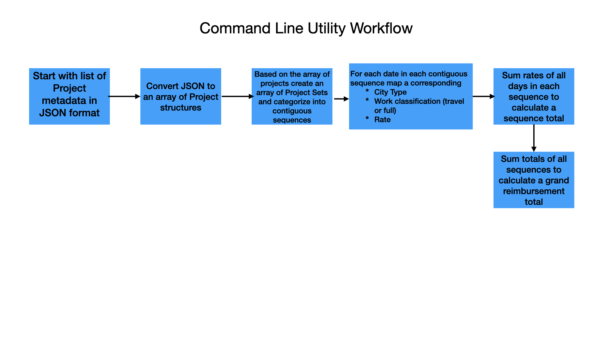

# Simple Thread Tech Assessment

This document describes my engineering design process while attempting Simple Thread's tech assessment. Parts of this document may not be comprehensive due to time-constraints. In brief, I approach engineering problems starting from user or customer needs and work backwards towards a technological solution. 

# Table of Contents

1. [Observations about the problem](#observations-about-the-problem)
2. [Problem Statement](#problem-statement)
3. [Need Statement](#need-statement)
4. [Literature and Product Review](#literature-and-product-review)
5. [Target Customer](#target-customer)
6. [User Requirements](#user-requirements)
7. [Concept Generation](#concept-generation)
8. [Idea Organization](#idea-organization)
9. [Solution Selection](#solution-selection)
10. [Component Diagram](#component-diagram)
11. [Design Verification](#design-verification)
12. [Design Validation](#design-validation)
13. [Regulatory Aspects](#regulatory-aspects)
14. [Project Abstract](#project-abstract)
15. [Executive Summary](#executive-summary)
16. [References](#references)

## Observations about the problem

A client organization works on multiple professional projects that involve overlapping timelines and travel. These projects involve traveling to both low and high cost of living cities. The organization needs to know how much it should be reimbursed for its work.

Digital reimbursement tracking and calculators exist in many forms. Popular accounting software tools such as QuickBooks allow employees to record, categorize, and review expenses. Other tools such as TripLog focus primarily on recording one type of expense (e.g. mileage) and then integrating with larger accounting suites. Finally, there is a whole nest of time-tracking utilties which allow consultants to easily invoice for time-based work. This camp includes incumbents such as Toggl.

The client organization's reimbursement amounts are not per diem. Instead, reimbursements are calculated according to the following rules:

- A client is reimbursed for a set of projects at a time.
- Any given day is only ever reimbursed once, even if multiple projects are on the same day.
- Projects that are contiguous or overlap, with no gap between the end of one and the start of the next, are considered a sequence of projects and should be treated similar to a single project.
- First day and last day of a project (or sequence of projects) are travel days.
- Any day in the middle of a project (or sequence of projects) is considered a full day.
- If there is a gap between projects, those gap days are not reimbursed and the days on either side of that gap are travel days.
- When projects overlap on the same day, higher reimbursements take priority.

The client will be reimbursed at the following rates:

- A travel day is reimbursed at a rate of 45 dollars per day in a low cost city.
- A travel day is reimbursed at a rate of 55 dollars per day in a high cost city.
- A full day is reimbursed at a rate of 75 dollars per day in a low cost city.
- A full day is reimbursed at a rate of 85 dollars per day in a high cost city.

Use of existing tools like QuickBooks would require manually creating records for every work day while having separate expense categories for the different reimbursement rates. This is an error-prone process as categorization must be set correctly on every record. In addition, a separate "expense" report must be created for each set of projects with the correct filters applied.

This problem is not well served by existing accounting software due to the manual work involved and classification of work reimbursements as expenses. This problem also not well served by existing time-tracking utilties because reimbursement rates are not based on per diem billing.

## Problem Statement

The client organization lacks a system to accurately calculate reimbursements for their multi-project work environment with a complex hierarchy of reimbursement rules.

## Need Statement

Given a set of projects with their corresponding timelines and travel details the client organization needs a specialized tool to accurately calculate project reimbursements.

## Literature and Product Review

In this section, I would analyze the existing market of tools that can solve a problem. For this exercise I have summarized the benefits and risks of 4 solutions to the reimbursement problem.

| Solution | Features | Benefits | Risks or Limitations |
|----------|----------|----------|---------------------|
| QuickBooks | Full accounting suite with payroll and invoicing capabilities. There is an API to access many functions of the software. | All your business data can live in a centralized hub. Can build tools that integrate with the QuickBooks API. Can create customized reports for different parts of your business. | Risks categorizing reimbursement income as an "expense". Each work day would need to be categorized correctly. |
| Toggl | Single or team based time tracking with project-based invoicing and reports. | Available on most computing platforms and makes time tracking workflow simple. Can include per-deim and fixed-fee billable rates. | Primary limitation is that only a single billable rate can be assigned to a single project. Client would need to create multiple projects for each underlying reimbursement rate.  No way to treat multiple projects as a single set as per the client's requirements. |
| Excel Spreadsheet | Versatile tool that can be customized to meet most daily analytical workflows | Can create a template worksheet that meets client reimbursement rules exactly. Excel has native support for datetime variables. | This would require the client to create complex formulas to ensure data accuracy.  There would need to be a separate sheet for each project set. |
| Paper based calculation and record keeping | Paper based reimbursement calculation can be done by anyone with a limited technical background. | Legal and Regulatory Acceptance  No risk of digital data breach.  Standardized template can make for a very simple workflow | Manual calculations have to be verified for accuracy  Searching for previous records can be time-consuming.  Separate sheet for each project set |

## Target Customer

The tool would primarily be used by only the client organization. If scope is expanded to include handling any specialized reimbursement workflow than the target market could include consultants, insurance enterprises, and general contractors.

## User Requirements

For this exercise the primary user requirement is that the solution have a **simple user experience**.

Based on this request, I will consider 5 factors of usability in solution selection:

1. Effectiveness - Users can complete actions accurately
2. Efficiency - Users can complete actions quickly
3. Familiarity - Users do not break existing mental models when using the new solution
4. Engagement / Ease of Use - Users find the solution appropriate for the problem at hand. Users can easily integrate the solution into existing workflows. 
5. Error Tolerance - Users are presented with errors or help menus only when appropriate. The solution should validate inputs.

## Concept Generation

1. A command line utility
2. A web app
3. A react-native mobile app
4. A native mobile app
5. An electron desktop app
6. A native desktop app
7. Spreadsheet
8. Paper notebook
9. Automation or Extension (Zapier, QuickBooks extension, Apple Shortcut, etc.)

## Idea Organization

Three categories of concepts:

1. Template Based Solutions
    - Spreadsheet
    - Pape rNotebook

This category of solutions emphasizes structuring the calculation workflow into a set of standardized manual steps.

2. GUI Applications
    - Web App
    - React-native mobile app
    - Native mobile app
    - Electron desktop app
    - Native desktop app

This category of solutions emphasizes user engagement and familiarity by building on the mental model of other commonly used apps.

3. Data Processing Utilities
    - Command line utility
    - Automation or extension

This category of solutions emphasizes efficiency and effectiveness.

## Solution Selection

For this exercise I will not use any quantitative method to rank concepts such as a Pugh Matrix. 

I have chosen to develop a command line utility as the solution to this problem. I will do the following to maintain a simple user experience:

- I will enforce structure on input data to derive most of the benefits of the Template Based Solutions described above.
- I will follow established conventions of other command-line utilties to maintain familiarity.
- I will choose a development environment that emphasizes performance and strict type-checking to maximize efficiency and effectiveness. For this exercise, I have chosen to use Swift to develop my command line utility.
- I will optionally show the steps of the calculation to the user to maintain ease of use.

## Command Line Utility Workflow

## Design Verification

- [X] Ensure input data is serializable into JSON.
- [X] Ensure utility has help menu
- [X] Ensure utility shows steps of reimbursement calculation
- [X] Ensure output is human-readable

## Design Validation

- [ ] Implement unit tests verifying JSON import
- [ ] Implement tests verifying calculation on example project sets

## Regulatory Aspects

No audit or historical context requirements were part of this exercise.

## Project Abstract

## Executive Summary

## References

No references.